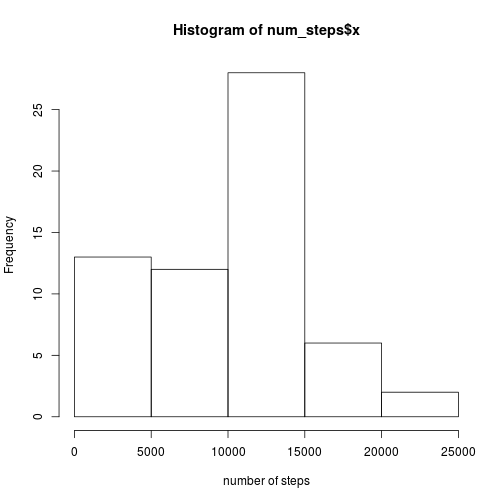
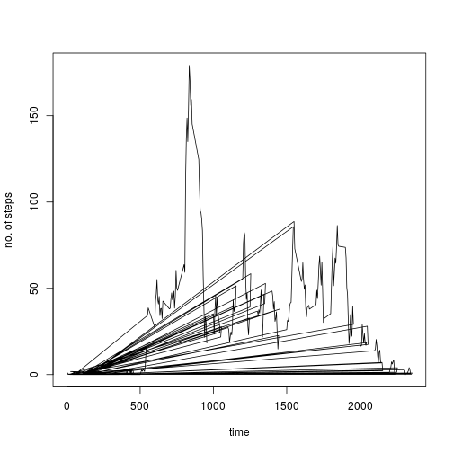

## Loading and preprocessing the data

Load the data. The second column is a date, the third column a factor


```r
if(!file.exists("activity.csv")) {
    unzip("activity.zip")
}

setClass("myDate")
setAs("character", "myDate", function(from) as.Date(from, format="%Y-%m-%d"))
data <- read.csv("activity.csv", colClasses=c(NA,"factor", "factor"))
```

## What is mean total number of steps taken per day?

calculate the total number of steps per day

```r
num_steps <- with(data, aggregate(steps, by=list(date), FUN = sum, na.rm=TRUE))
```

plot a histogram


```r
hist(num_steps$x, xlab="number of steps")
```

 

Calculate the mean and the median of the total number of steps.


```r
mean(num_steps$x, na.rm=TRUE)
```

```
## [1] 9354.23
```

```r
median(num_steps$x, na.rm=TRUE)
```

```
## [1] 10395
```

## What is the average daily activity pattern?

Calculate the average number of steps taken in each 5-minute interval


```r
step_average <- tapply(data$steps, data$interval, sum, na.rm=TRUE, simplify=TRUE)/length(levels(data$date))
```

plot the time series of the average number of steps:


```r
plot(x=levels(data$interval), y = step_average, type="l", xlab="time", ylab= "no. of steps")
```

 

The maximum number of steps on average across all days is


```r
names(which.max(step_average))
```

```
## [1] "835"
```

## Imputing missing values

Calculate the total number of missing values


```r
missing_values <- sum(is.na(data$steps))

missing_values
```

```
## [1] 2304
```


## Are there differences in activity patterns between weekdays and weekends?
